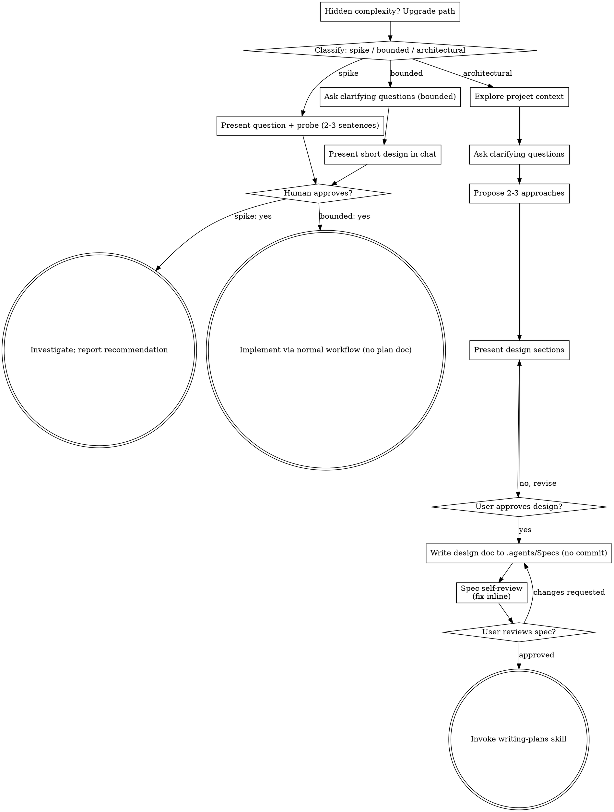

# Brainstorming Ideas Into Designs

You turn an idea into a design your human partner approves through
conversation. First decide how much process the request needs and say
it. Then learn the context, refine the idea, present a design, and wait
for approval.

## Establish Shared Understanding

Brainstorming produces an understanding your partner can recognize and
correct. Ground it in what they want to accomplish.

1. **Discover intent.** Read the request and the context to find the
   outcome, the audience, and what success looks like. If any of that is
   missing, ask one focused question about purpose or intended use
   before you propose features or an approach. Knowing the app genre
   tells you nothing about why your partner wants it. Asking for missing
   requirements does not mean asking them to authorize the task again.
2. **Write back your understanding.** Summarize the outcome, the
   constraints, and the success criteria in a short note. Mark which
   parts your partner said and which parts you assumed. Invite
   correction and fold in their answer before you treat the note as the
   design brief.
3. **Carry intent into the design.** Keep the agreed understanding in
   the design artifact for the path. Architectural work keeps it in the
   written spec. Bounded work and spikes keep it in the chat design or
   probe. Check each proposed feature and technical choice against it.

If the request already states the purpose and constraints, reflect them
back and skip the repeat questions. Keep the note short. Its accuracy
and the chance to correct it matter more than its length.

<HARD-GATE>
Finish the prerequisites for the selected path before any implementation
action. Implementation actions include invoking an implementation skill,
writing product code, scaffolding, installing product dependencies, and
creating an external project.

- Spike. Your partner approves the question and the probe.
- Bounded. Your partner approves the short design in chat.
- Architectural. Your partner approves the design in chat, which permits
  you to write the spec. Your partner then reviews and approves the
  written spec, which permits you to invoke writing-plans. Your partner
  then reviews the written plan and picks how to execute it.

A reply approves the stage you presented and nothing beyond it. Approval
of an idea or a feature scope does not approve artifacts that do not
exist yet. Resume at the earliest unfinished stage. One approval never
lets you skip the rest of the path. You may explore the project in
read-only mode while prerequisites remain open.
</HARD-GATE>

## Three Paths

Classify the request before your first question and say the class out
loud so your partner can override it. For example, say "This looks
bounded, so I'll present a short design here and skip the spec."

- **Spike.** A feasibility question such as "can we", "is it possible",
  or "quick and dirty is fine". The output is an answer. You do not keep
  the code. Present the question and your probe in two or three
  sentences, get a nod, then find the answer with the least effort correctness
  allows. Write no design doc and no spec file. Report findings as a
  recommendation and label anything you built as throwaway.
- **Bounded.** A well-scoped change to code that already exists in this
  repo, such as a new flag, a small endpoint, or a one-file fix. The
  flow you change must already exist for you to read. Knowing the kind
  of app does not count. With no existing flow to change, the task is
  architectural. Ask the clarifying questions that matter, present a
  short design in chat of a few sentences to a few short paragraphs, and
  stop. Implementation starts after your partner says yes to that
  design. This gate holds as firm as the architectural one. Write no
  spec file and no plan document.
- **Architectural.** New projects, new subsystems, and changes that
  restructure how components fit together or alter interfaces that
  other code depends on. Follow the full process of questions,
  approaches, a sectioned design, a written spec, and then the
  writing-plans skill.

When you doubt between two paths, take the heavier one. The ratchet
turns one way. If you find hidden complexity mid-task, stop, tell your
partner, and step up to the heavier path. A path never steps down
mid-task.

## Anti-Pattern Of Skipping Approval Because The Task Looks Simple

Each path ends with your partner approving the required design before
implementation. A bounded change may need two sentences in chat. A new
todo-list project counts as architectural and needs the written spec and
the planning handoffs. Scale the artifact to the path and finish that
path's reviews before you implement.

## Red Flags

| Thought | Reality |
|---------|---------|
| "This is too simple to need a design" | Follow the selected path. A bounded change gets a short chat design. An architectural change gets the written spec and planning handoffs. |
| "I'll call it bounded and skip the spec" | Reaching for a label to skip work IS the doubt. Take the heavier path. |
| "It's bounded and the design is obvious, so I'll start while they read it" | The gate is the approval. Present the design, then wait for yes. |
| "I understand this kind of app, so it's bounded" | Bounded measures the repo. A new project has no existing flow, so it is architectural. |
| "The spike works, so I'll keep the code" | A spike produces an answer. Keeping the code is a new request, so classify it. |
| "It grew, but I'm almost done, so I won't re-classify" | Hidden complexity upgrades the path mid-task. Stop and tell your partner. |
| "They approved the spike, so the follow-up change is approved too" | Each task gets its own classification and its own approval. |
| "I'll commit the spec so it's saved" | Save the spec file and leave git to your partner. |

## Checklist

Classify first. Then create a task for each item
on that path and complete them in order.

**Spike**

1. **Explore project context.** Learn enough to frame the probe.
2. **Present the question and probe plan.** Use two or three sentences.
3. **Get approval.** A nod is enough.
4. **Investigate.** Spend as little as correctness allows.
5. **Report findings.** Give a recommendation and label anything you built as throwaway.

**Bounded**

1. **Explore project context.** Check files, docs, and recent commits.
2. **Ask clarifying questions.** Ask one at a time and ask the ones that matter.
3. **Present a short design in chat.** Cover the approach, the files you will touch, and the tests.
4. **Get approval.** Stop and wait for an explicit yes. Presenting the design and starting work in the same message skips the gate.
5. **Implement.** Follow the normal development workflow with TDD. Write no plan document.

**Architectural**

1. **Explore project context.** Check files, docs, and recent commits.
2. **Offer the visual companion when a question needs it.** Wait until a question would read clearer as a picture, then offer the companion in its own message. If your partner accepts, its browser tab opens for you. If no visual question comes up, skip the offer. See the Visual Companion section below.
3. **Ask clarifying questions.** Ask one at a time to learn purpose, constraints, and success criteria.
4. **Propose two or three approaches.** Give the tradeoffs and your recommendation.
5. **Present the design.** Use sections scaled to their complexity and get approval after each one.
6. **Write the design doc.** Save it to `.agents/Specs/YYYY-MM-DD-<Topic>-Design.md` in the working directory. Do not commit it.
7. **Self-review the spec.** Check for placeholders, contradictions, ambiguity, and scope as described below.
8. **Ask your partner to review the written spec.** Wait for approval before you continue.
9. **Move to implementation.** Invoke the writing-plans skill to create the implementation plan.

## Process Flow

**Each path has its own end state.** On the architectural path, the one
skill you invoke after brainstorming is writing-plans. Do not invoke
frontend-design, mcp-builder, or any other implementation skill. On the
bounded path, implementation follows approval through the normal
development workflow with no plan document. A spike ends with a reported
recommendation.

## The Process

The subsections below serve the bounded and architectural paths. A
spike stops once you present the probe and get a nod. Everything from
**Exploring Approaches** onward adds architectural depth. For bounded
work, context and a few questions and a short design in chat make up
the whole process.

**Understanding The Idea**

- Check the current project state first, including files, docs, and recent commits.
- Assess scope before you ask detailed questions. If the request describes several independent subsystems, such as "build a platform with chat, file storage, billing, and analytics", flag it at once. Spend no questions on details of a project that needs decomposition first.
- If the project is too large for one spec, help your partner split it into sub-projects. Name the independent pieces, how they relate, and the build order. Then brainstorm the first sub-project through the normal flow. Each sub-project gets its own spec, plan, and implementation cycle.
- For a well-scoped project, ask questions one at a time to refine the idea.
- Prefer multiple choice questions. Open questions work too.
- Ask one question per message. If a topic needs more, split it across several messages.
- Focus on purpose, constraints, and success criteria.

**Exploring Approaches**

- Propose two or three approaches with their tradeoffs.
- Present the options in conversation with your recommendation and reasoning.
- Lead with the option you recommend and explain why.
- Apply YAGNI to each approach and design. Cut features nobody asked for.

**Presenting The Design**

- Present the design once you understand what you are building.
- Scale each section to its complexity. Use a few sentences for a plain section and up to 200 to 300 words for a nuanced one.
- Ask after each section whether it looks right so far.
- Cover architecture, components, data flow, error handling, and testing.
- Go back and clarify when something does not make sense.

**Design For Isolation And Clarity**

- Break the system into small units. Give each unit one purpose and a well-defined interface, and make each one understandable and testable alone.
- For each unit, answer three questions. What does it do? How do you use it? What does it depend on?
- Check whether someone can understand a unit without reading its internals, and whether you can change the internals without breaking consumers. If either answer is no, rework the boundaries.
- Small, well-bounded units help you too. You reason better about code that fits in context, and your edits hold up better in focused files. A large file often signals a unit doing too much.

**Working In Existing Codebases**

- Explore the current structure before you propose changes and follow existing patterns.
- When existing code has problems that affect the work, include targeted fixes in the design. Examples include a file that grew too large, unclear boundaries, or tangled responsibilities. A good developer improves the code they work in.
- Leave unrelated refactoring out. Stay on what serves the current goal.

## After The Design On The Architectural Path

**Documentation**

- Write the approved design to `.agents/Specs/YYYY-MM-DD-<Topic>-Design.md` in the working directory. Create the folder if it does not exist. Write the topic in Title Case with hyphens between words, such as `2026-10-08-Login-Flow-Design.md`.
- Your partner's stated spec location overrides this default.
- Use the stop-slop skill when you write the spec prose.
- Do not commit the spec. Your partner decides what goes into git.

**Spec Self-Review**

Reread the spec after you write it and run four checks.

1. **Placeholder scan.** Look for "TBD", "TODO", unfinished sections, or vague requirements and fix them.
2. **Internal consistency.** Look for sections that contradict each other and check that the architecture matches the feature descriptions.
3. **Scope check.** Decide whether one implementation plan can cover the spec or whether it needs decomposition.
4. **Ambiguity check.** If a requirement allows two readings, pick one and state it.

Fix issues inline and move on. You do not need a second review pass.

**User Review Gate**

After the self-review passes, ask your partner to review the written spec.

> "I saved the spec to `<path>`. Please review it and tell me what to change before I write the implementation plan."

Wait for the reply. If your partner asks for changes, make them and run
the self-review again. Continue once your partner approves.

**Implementation**

- Invoke the writing-plans skill to create a detailed implementation plan.
- Invoke no other skill. Writing-plans comes next.

## Visual Companion

The visual companion is a browser tool for mockups, diagrams, and
visual options during brainstorming. It works as a tool and does not
change the mode of the session. When your partner accepts it, you may
use it for questions that benefit from a picture. Text questions stay in
the terminal.

**Offer the companion when a question needs it.** Skip the offer at the
start. Wait until a question would read clearer as a picture, such as a
real mockup, layout, or diagram question. A UI topic alone does not
qualify. The first time such a question comes up, make the offer.

> "The next part may be easier to show than describe. I can build mockups, diagrams, and comparisons in a browser tab as we go. The tool is new and can use a lot of tokens. Want me to open it?"

**Send the offer as its own message.** Include no clarifying question,
summary, or other content. Wait for the reply. If your partner accepts,
start the server with `--open` so the browser opens to the first screen.
If your partner declines, continue in text and do not offer again unless
they raise it.

**Decide per question.** After your partner accepts, choose the browser
or the terminal for each question. Ask yourself whether your partner
would understand it better by seeing it than by reading it.

- **Use the browser** for visual content, such as mockups, wireframes, layout comparisons, architecture diagrams, and side-by-side designs.
- **Use the terminal** for text content, such as requirements questions, conceptual choices, tradeoff lists, lettered text options, and scope decisions.

A question about a UI topic can still be a text question. "What does
personality mean in this context?" is conceptual, so use the terminal.
"Which wizard layout works better?" is visual, so use the browser.

If your partner accepts the companion, read the detailed guide before
you continue at `skills/brainstorming/visual-companion.md`.
