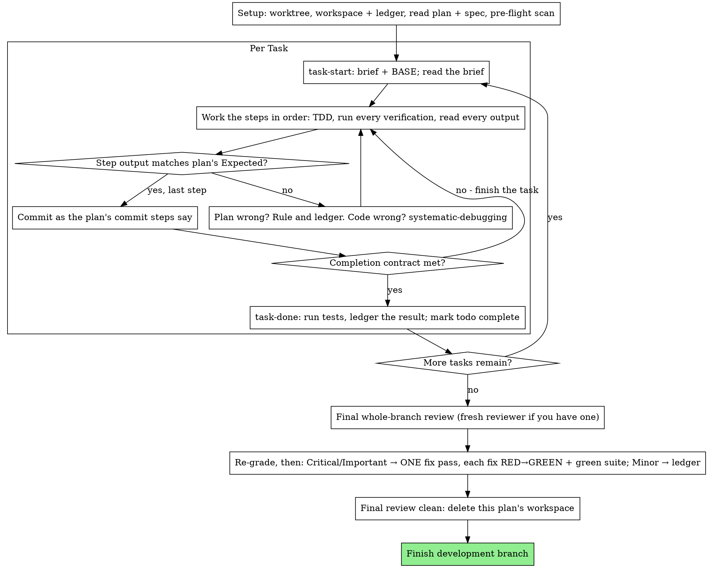

# Executing Plans

Execute the plan yourself in this session, one task at a time. You
dispatch no implementer subagent and no reviewer per task. One reviewer
with a fresh context checks the whole branch at the end.

**Why Inline.** Subagent-driven development pays for a fresh implementer
and a fresh reviewer on each task, and each one rereads the codebase from
zero. Inline execution pays for your one context plus one reviewer at the
end. You give up a fresh context per task and a second pair of eyes per
task. This skill recovers what those bought in other ways. The brief
holds the requirements. The ledger holds your memory. TDD gates each
task. The final reviewer supplies the second pair of eyes.

**Core Principle.** The plan already did the thinking. Execute it as
written, prove each step with a test you watched fail and then pass, and
leave a record that survives your own forgetting.

**Narration.** Write at most one short line between tool calls. The
ledger and the tool results carry the record.

**Continuous Execution.** Do not pause to check in with your human
partner between tasks. They chose inline execution to spend less, and
answering "should I continue?" after each task costs them time. Execute
all tasks in the plan without stopping.

**Rule On Problems And Keep Moving.** Decide conflicts, ambiguities, and
plan defects yourself. The spec binds you, the plan argues from it, and
your judgment settles what neither answers. Record each decision in the
ledger as `Ruling: <what you decided> — <why> — <what it costs if wrong>`,
and keep going. A deviation from the plan without a ledger ruling is a
decision made in secret.

Four things stop you, and nothing else does.

1. An irreversible or destructive operation.
2. A security-sensitive action.
3. A side effect outside this worktree that norms say you ask about
   first, such as a merge, a push to a shared branch, or a publish.
4. A plan so broken that each path forward is a guess.

For those four, stop and ask.

## When To Use

- You have a plan from superpowers:writing-plans and your human partner
  chose inline execution at the handoff.
- Your harness has no subagent tool. The per-platform references in
  `../using-superpowers/references/` describe each harness. Never fake a
  dispatch. Run the plan here.
- The tasks are mostly independent, the same precondition that
  superpowers:subagent-driven-development has.

A fully specified plan turns inline execution into transcription plus
testing. It runs well on a mid-tier session model. The most capable model
earns its cost at the final review, which this skill dispatches on its
own. Tell your human partner this when they choose inline.

Prefer superpowers:subagent-driven-development when your human partner
wants a review gate on each task, or when the plan runs long enough that
its later tasks would execute on a compacted context. Inline execution
still works on a long plan because the ledger makes it recoverable, but
the last tasks get the least of your attention.

## The Process



## Setup

Make sure the work happens in an isolated workspace. Use git worktree
commands to create one or to verify the existing one. Never start
implementation on a main or master branch without your human partner's
explicit consent.

Conversation memory does not survive compaction. An inline executor that
loses its place reimplements tasks whose commits already exist. A
controller that re-dispatches finished tasks makes the same mistake, and
here you pay for it in your own context. Track progress in a ledger file
as well as in todos. Harness todos give a live view, and the ledger keeps
the record.

You share the workspace and ledger with
superpowers:subagent-driven-development. Both use the same directory and
the same format, so a plan can switch executors partway through and the
new one resumes from the same ledger.

- Each plan owns a workspace. At skill start, run
  `../subagent-driven-development/scripts/sdd-workspace PLAN_FILE`. It
  prints the plan's git-ignored directory at
  `<repo-root>/.superpowers/sdd/<plan-basename>/`. That directory holds
  each artifact for THIS plan, including the ledger, briefs, and review
  packages. Never read or write another plan's directory.
- Look for this plan's ledger at `<workspace>/progress.md`. If its first
  line names your plan file, each task with a `Task <N>: complete` line is
  DONE. Do not redo it. Resume at the first task without that line. Those
  commits exist in git even when your context no longer remembers making
  them. After compaction, trust the ledger and `git log` over your own
  recall. A ledger whose first line names a different plan file belongs to
  another plan. Leave it and start your own.
- Create the ledger with its identity as the first line,
  `# SDD ledger — plan: <plan file path>`.
- `git clean -fdx` destroys the workspace because the workspace is
  git-ignored scratch. If that happens, recover from `git log`.

Read the plan once, note its context and Global Constraints, and create a
todo per task. If the plan names a Spec, read it too. The spec is the
authority the plan argues from, and conflicts inside the plan resolve
against it. If the plan has no reachable spec, write a ledger note that
says so. Rulings made without a spec stay provisional.

**REQUIRED SUB-SKILL.** Load superpowers:test-driven-development now,
before Task 1. It governs each step of each task below. A plan whose
steps already say "write the failing test first" does not exempt you from
reading it.

Before Task 1, scan the plan for conflicts between tasks. The plan's
Interfaces blocks show you where to look. For each task that consumes
what an earlier task produces, write one ledger row. The row names the
two tasks, compares what one produces against what the other consumes,
and states what you found. Tasks that share nothing get no row. A plan
whose tasks share nothing gets the single line
`Pre-flight: no shared interfaces`. Rule on each conflict a row surfaces,
with the spec as the binding authority. Record the ruling beside its row
and start Task 1. You check each task's own text later, when you read its
brief.

## The Task Loop

Everything you print and each tool result stays in your context for the
rest of the session. Send long test output to a file in the workspace and
read its tail. Read a brief instead of the whole plan.

### 1. Take The Task

- Run this skill's `scripts/task-start PLAN_FILE N`. It prints the brief
  path and BASE in one call. BASE is the commit that starts the task's
  review range. Read the brief for each task, including ones you remember
  from setup. Your memory holds a summary. The brief holds the exact
  values, signatures, and test cases.
- Mark the task's todo in_progress.

Each tool call is a turn that rereads your whole context. Do bookkeeping
alongside real work. Put a ledger append in the same call as the commit
and never in a call of its own.

### 2. Work The Steps

The plan's steps already follow RED then GREEN order. Follow that order
under superpowers:test-driven-development, which you loaded at setup.
Write a test step's code first and run it first. Watching the test fail
counts as a step. If a test passes before the implementation exists, you
have found a problem with the test.

Each step that runs a command has an `Expected:` line. Run the command,
read its output, and compare. You will see one of three outcomes.

- **It matches.** Go to the next step.
- **The code is wrong.** Use superpowers:systematic-debugging. Find the
  cause. Never patch the symptom to make the output match.
- **The plan is wrong.** A step contradicts the spec, an interface from an
  earlier task differs from what this task consumes, or a command cannot
  work. Rule on the smallest change that satisfies the spec. Ledger it as
  `Task <N>: Ruling: <finding> — <what you decided and why>` and continue.
  Later tasks that touch the same interface read the ruling from the
  ledger, so you do not need to remember it.

Commit as the plan's commit steps say. A task may span several commits.
Cut the review range from BASE and never from `HEAD~1`.

### 3. The Completion Contract

Before you write a task's ledger line, each item below must hold, with
evidence from this session. A diff that looks right is not evidence.

- Each test the brief names exists, ran in this task, and you read the
  output.
- The task's final test run passed. `task-done` performs that run and
  writes the command and result into the ledger line.
- You compared each `Expected:` line in the brief against real output.
- Each deviation from the brief has a `Ruling:` line in the ledger.

**REQUIRED SUB-SKILL.** superpowers:verification-before-completion
governs the claim. If any item is missing, the task is incomplete. Finish
it.

### 4. Complete The Task

Run this skill's `scripts/task-done PLAN_FILE N BASE -- <test command>`
with the test command the brief names for the whole task. The script runs
the tests, keeps the full output in the workspace, and prints the tail.
If the tests pass, it appends the completion line to the ledger.

`Task <N>: complete (commits <base7>..<head7>, tests: <command> → <result>)`

A failing run records nothing, and the task stays incomplete. When the
script records the line, mark the todo complete and take the next task.

## Final Review

Run `../subagent-driven-development/scripts/review-package PLAN_FILE MERGE_BASE HEAD`
and review from the file it prints. MERGE_BASE is the commit the branch
started from, which `git merge-base main HEAD` gives you.

**With A Subagent Tool.** Dispatch the reviewer on the most capable
available model, because a whole-branch review takes judgment. Use a code
reviewer prompt and give it these inputs.

- The package path.
- The plan and spec paths.
- The plan's Review Focus section copied word for word, if the plan has
  one. It lists the input classes and failure modes the plan's tests do
  not exercise, and the reviewer checks each one on purpose.
- A pointer to the ledger's `Ruling:` lines so the reviewer can weigh the
  calls you made.

Name the model in the dispatch. A dispatch without a model inherits the
session's model, which may be weaker. This review is the one fresh
context the whole run buys. Do not skip it, and do not replace it with
your own read of the diff.

**Without A Subagent Tool.** Read code-reviewer.md and perform that
review yourself against the package, as a separate pass after the last
task's ledger line. Write `Final review: self-review (no subagent tool)`
to the ledger and say so in your final message. An author reviewing their
own work catches less than a fresh reviewer, and your human partner
decides whether that is enough before merge.

Sort the findings before you act on any of them. The reviewer's severity
labels are advice, and the gate belongs to you. The reviewer's "Declined
to judge" list belongs to you too. Make a ruling on each line there and
ledger it the same way you ledger a plan conflict, as
`Final: Ruling: <behavior the reviewer set aside> — <what a reasonable person using this software gets, and why that stands or why it is now a finding> — <cost if wrong>`.

Re-grade each finding by its effect first. The spec describes a vision.
A finding's grade reflects what a reasonable person using this software
gets if it ships. Whether the spec names the triggering input does not
matter. A reviewer who marked a finding Minor because the spec said
nothing graded the spec and missed the effect. Then route the findings.

- **Critical and Important** findings enter the fix pass.
- **Minor** findings go to the ledger as
  `Final: minor (deferred): <one-liner>` and to your final message under
  "Deferred minors". Minors never enter the fix pass and never become
  rulings. A ruling decides a conflict. Declining a polish suggestion
  needs no ruling.

You are the implementer here, so fix the Critical and Important findings
yourself in ONE pass. TDD verifies each fix, and no second reviewer
does. Write the test that reproduces the finding, watch it fail, make it
pass, and run the whole suite. Record each fix in the ledger as
`Final: fixed <finding> — <test name> RED→GREEN, suite <N>/<N>`. A fix
without a test that failed first stays unverified. The pass ends once the
whole suite is green. Do not dispatch a re-review. Its covering tests
already show each finding is addressed, and the suite run already shows
nothing broke.

A finding you decide not to fix becomes a ruling,
`Final: Ruling: <finding> — <why the code stands> — <cost if wrong>`, and
reaches your human partner in the rulings list. You get one fix pass and
no second one.

## Finish

Before you delete anything, copy each ledger line that contains `Ruling:`
into your final message under "Rulings I made". Keep the order you made
them in and include what each costs if wrong. Copy each
`minor (deferred)` line under "Deferred minors". Both lists must be
complete. Your final message is the one place where your human partner
sees the decisions you made for them and the findings you chose to leave.

When the final review is clean and its fixes are committed, delete this
plan's workspace directory. The git history now holds the record. Sibling
directories belong to other plans, so leave them alone.

You may ask your human partner to review and merge the branch.

## Common Rationalizations

| Excuse | Reality |
|--------|---------|
| "I remember what Task N says" | You remember a summary. The brief has the exact values. Read it. |
| "The plan's code is right, skip watching the test fail" | A test you never saw fail proves nothing. Watching it fail is one step. Run it. |
| "I'll run the full suite at the end instead of per step" | Per-step runs tell you which step broke it. The end-of-task run is the contract and does not replace them. |
| "The plan is wrong here, I'll do the right thing" | Do the right thing and ledger the ruling. A deviation without a ledger line is a decision made in secret. |
| "I'll write the ledger lines after a few tasks" | Compaction does not wait for a good moment. Write one line per task, in the same call as the commit. |
| "Let me check in before the next task" | They chose inline to spend less. Progress prompts spend their time. The four stops are the only stops. |
| "I read my own diff with care, so the final reviewer is redundant" | The same author has the same blind spots. The reviewer is the one fresh context this run buys. |
| "Tests should pass, the change was trivial" | "Should" is not evidence. The contract requires the command and its output. |
| "Subagents are slow and expensive, I'll skip the final review too" | Inline already removed the per-task reviewers. One review of the whole branch is the minimum. |
| "The reviewer said Minor, so it's Minor" | The label graded the spec's silence. Grade what the person gets. Re-grade, then gate. |
| "The fix is obvious, no need for a failing test first" | The failing test is the only proof that the finding was real and is now gone. Without it you have a diff and a hope. |
| "I'll fix the minors too while I'm in there" | Each minor you fix costs a test, a fix, and a suite run your partner did not ask for. Ledger them and let your partner decide. |

## Example Workflow

```
[Setup: worktree verified]
[Read plan once: .agents/Plans/2026-10-08-Feature-Plan.md; spec read]
[Resolve workspace: sdd-workspace .agents/Plans/2026-10-08-Feature-Plan.md — no ledger inside, fresh start]
[Pre-flight scan: 2 shared-interface rows, 4 self-consistency rows, clean; written to ledger]
[Create todos for all tasks]

Task 1: Hook installation script

[task-start plan 1 → brief read; BASE a1b2c3d]
[Step 1: write failing test — written]
[Step 2: run it — FAIL: install_hook not defined. Matches Expected.]
[Step 3: implement — written]
[Step 4: run it — PASS 1/1. Matches Expected.]
[Step 5: commit — d4e5f6a]
[Contract: tests ran, output read, no deviations]
[task-done plan 1 a1b2c3d -- npm test -- hooks → ledger: Task 1: complete (commits a1b2c3d..d4e5f6a, tests: npm test -- hooks → 1/1 pass)]

Task 2: Recovery modes

[task-start plan 2 → brief read; BASE d4e5f6a]
[Step 2: run failing test — FAIL, but on an import error: Task 1 exported
 installHook, brief consumes install_hook]
[Ruling: brief's consumer name is a typo against Task 1's Produces block;
 use installHook — Ledger: Task 2: Ruling: install_hook → installHook — matches Task 1 Produces — cost if wrong: one rename]
[Steps 2-5 as planned; commit b7c8d9e]
[task-done plan 2 d4e5f6a -- npm test -- recovery → ledger: Task 2: complete (commits d4e5f6a..b7c8d9e, tests: npm test -- recovery → 8/8 pass)]

...

[After all tasks: review-package plan MERGE_BASE HEAD; dispatch code-reviewer, most capable model]
Reviewer: One Important finding — progress reporting interval hardcoded. Two Minor.
[Re-grade: Important stands; minors → ledger as deferred]
[Fix pass: test_progress_interval_configurable RED → extract PROGRESS_INTERVAL → GREEN; suite 12/12; commit]
[Ledger: Final: fixed hardcoded interval — test_progress_interval_configurable RED→GREEN, suite 12/12]

Rulings I made:
- Task 2: install_hook → installHook (brief typo; cost if wrong: one rename)

Deferred minors:
- README lacks a usage example
- recovery.js could split verify/repair into two files

[Delete this plan's workspace — the record now lives in git]

(Ready for merge).
```
