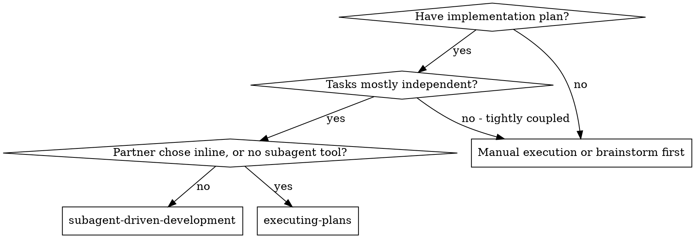
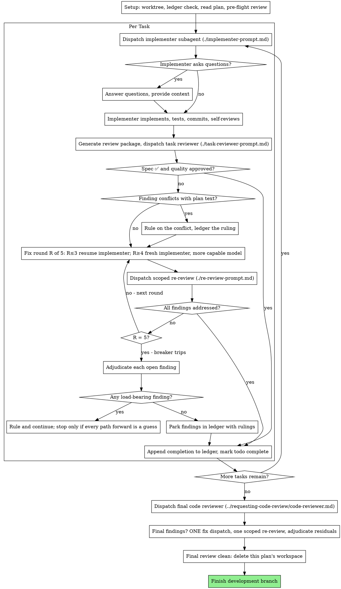

# Subagent-Driven Development

Execute the plan by dispatching a fresh implementer subagent per task. A
task review checks spec compliance and code quality after each task, and
a broad whole-branch review runs at the end.

**Why Subagents.** You delegate tasks to specialized agents with isolated
context. When you write their instructions and context with care, they
stay focused and finish their task. They never inherit your session's
context or history. You build exactly what they need. This also keeps your
own context free for coordination.

**Core Principle.** A fresh subagent per task, a task review for spec and
quality, and a broad final review together give high quality and fast
iteration.

**Narration.** Write at most one short line between tool calls. The
ledger and the tool results carry the record.

**Continuous Execution.** Do not pause to check in with your human
partner between tasks. Execute all tasks in the plan without stopping.
You stop for the four reasons named below or when all tasks are complete.
"Should I continue?" prompts and progress summaries waste their time.
They asked you to execute the plan, so execute it.

**Rule On Problems And Keep Moving.** A running plan does not wait on a
human. Decide conflicts, ambiguities, plan defects, and any cap you would
have asked to exceed. The spec binds you, the plan argues from it, and
your judgment settles what neither answers. Record each decision in the
ledger as `Ruling: <what you decided> — <why> — <what it costs if wrong>`,
and keep going. A wrong ruling costs rework your human partner can see and
undo. A session parked on a question costs their whole day and buys
nothing.

Four things stop you, and nothing else does.

1. An irreversible or destructive operation.
2. A security-sensitive action.
3. A side effect outside this worktree that norms say you ask about
   first, such as a merge, a push to a shared branch, or a publish.
4. A plan so broken that each path forward is a guess.

For those four, stop and ask.

## When To Use



**Compared With Inline Executing Plans**
- A fresh subagent handles each task, so no task pollutes another's context. Inline uses one context for all tasks.
- A review of spec compliance and code quality follows each task. Inline reviews once at the end.
- This skill costs a fresh context per task and per review. Inline costs one context plus one final reviewer.
- Both run in this session, share the same plan workspace and ledger, and never pause between tasks.

## The Process



## Setup

Make sure the work happens in an isolated workspace. Use git worktree
commands to create one or to verify the existing one. Never start
implementation on a main or master branch without your human partner's
explicit consent.

Conversation memory does not survive compaction. In real sessions,
controllers that lost their place re-dispatched whole sequences of
finished tasks. That was the most expensive failure anyone observed. Track
progress in a ledger file as well as in todos.

- Each plan owns a workspace. At skill start, run this skill's
  `bash scripts/sdd-workspace PLAN_FILE`. It prints the plan's git-ignored
  directory under `<repo-root>/.superpowers/sdd/`. That directory holds
  each artifact for THIS plan, including the ledger, briefs, reports, and
  review packages. Never read or write another plan's directory.
- Look for this plan's ledger at `<workspace>/progress.md`. If its first
  line names your plan file, each task with a `Task <N>: complete` line is
  DONE. Do not re-dispatch it. Resume at the first task without that line.
  A task whose last line is a fix round sits mid-loop, so resume the loop
  at the next round. Leave two kinds of ledger in place and start your own.
  One is a ledger whose first line names a different plan file. The other
  is a stray ledger at the old flat path `.superpowers/sdd/progress.md`.
  Both belong to other plans.
- Create the ledger with its identity as the first line,
  `# SDD ledger — plan: <plan file path>`.
- The ledger is your recovery map. The commits it names exist in git even
  when your context no longer remembers creating them. After compaction,
  trust the ledger and `git log` over your own recall.
- `git clean -fdx` destroys the workspace because the workspace is
  git-ignored scratch. If that happens, recover from `git log`.

Read the plan once, note its context and Global Constraints, and create a
todo per task. If the plan names a Spec, read it too. The spec is the
authority the plan argues from, and conflicts inside the plan resolve
against it. If the plan has no reachable spec, write a ledger note that
says so. Rulings made without a spec stay provisional.

Before you dispatch Task 1, scan the plan once for conflicts and write
down what you checked as you go. Look for two things.

- Tasks that contradict each other or the plan's Global Constraints.
- Anything the plan mandates that the review rubric treats as a defect,
  such as a test that asserts nothing or a logic block copied word for
  word.

The scan produces a table. A verdict alone does not count. Write one row
for each pair of tasks that share a file or an interface. The row names
the two tasks, compares what one produces against what the other
consumes, and states what you found. Write one row for each task on
whether its own text agrees with itself. Compare the tests it specifies
against the code it specifies, and the files it creates against the files
it touches later. Saying "the scan is clean" without those rows means you
did not run the scan.

Write the table to the ledger. Before execution begins, rule on each
finding against the plan text that mandates it and record each ruling in
the ledger. The spec is the binding authority, and the plan argues from
it. Record each ruling beside its row. If the scan is clean, proceed
without comment and dispatch Task 1. The review loop catches conflicts
that only show up during implementation.

## Model Selection

Use the least powerful model that can handle each role. That saves cost
and adds speed.

**Mechanical Implementation Tasks.** Use a fast, cheap model for isolated
functions with clear specs that touch one or two files. Most
implementation tasks are mechanical when the plan is well specified.

**Integration And Judgment Tasks.** Use a standard model for multi-file
coordination, pattern matching, and debugging.

**Architecture And Design Tasks.** Use the most capable available model.
The final whole-branch review belongs here. Dispatch it on the most
capable available model and skip the session default.

**Review Tasks.** Pick the model with the same judgment and scale it to
the diff's size, complexity, and risk. A small mechanical diff does not
need the most capable model. A subtle concurrency change does. Scoped
re-reviews of small fix diffs take a cheap to mid tier.

**Fix-Loop Escalation In Rounds 4 And 5.** Use a model at least one tier
above the implementer that got stuck.

**Name the model in each subagent dispatch.** A dispatch without a model
inherits your session's model, which is often the most capable and most
expensive one. That defeats this whole section.

**Turn count beats token price.** Wall-clock time and context cost grow
with the number of turns a subagent takes. The cheapest models often take
two to three times the turns on multi-step work and cost more in the end.
Use a mid-tier model as the minimum for reviewers and for implementers
working from prose descriptions. When the task's plan text contains the
complete code to write, the implementation is transcription plus testing,
so use the cheapest tier for that implementer. Single-file mechanical
fixes also take the cheapest tier.

**Task Complexity Signals For Implementation Tasks**
- Touches one or two files with a complete spec. Use a cheap model.
- Touches several files with integration concerns. Use a standard model.
- Requires design judgment or broad codebase understanding. Use the most capable model.

## The Task Loop

**Batch small work of the same shape.** Sometimes the plan lists several
tasks that are each a small, independent edit of the same kind, such as
the same one-line fix, constant change, or field addition repeated across
files. Do not dispatch one subagent per task for those. Write ONE dispatch
brief that lists each file and its change, send the whole batch to a
single subagent, and review its diff as one unit. Keep one dispatch per
task for work that needs its own judgment, its own tests, or its own
review surface.

Everything you paste into a dispatch prompt and everything a subagent
prints back stays in your context for the rest of the session. You reread
it on each later turn. Hand artifacts over as files.

**Waiting On Dispatched Subagents.** Never poll a wait interface with
short timeouts, and never sit in one silent wait with no end. While you
have local work, such as ledger updates, packaging the next review, or
reading reports, keep working. Child results arrive on their own. When
you have nothing else to do, wait in bounded stretches of five to ten
minutes where your platform allows. Between stretches, post one line of
status and reconcile your live children. List them and chase any that
finished without reporting. Bounded stretches keep nearly all of a long
wait's efficiency and make sure you notice a stuck or lost child within
minutes instead of at the end of the session.

### 1. Dispatch The Implementer

Record BASE with `git rev-parse HEAD` before you dispatch. The review
package and the fix-round diffs need it.

- **Task Brief.** Before you dispatch an implementer, run this skill's
  `bash scripts/task-brief PLAN_FILE N`. It extracts the task's full text
  to a uniquely named file and prints the path. Write the dispatch so the
  brief stays the single source of requirements. The dispatch contains
  five things.
  1. One line on where this task fits in the project.
  2. The brief path, introduced as "read this first. It is your
     requirements, with the exact values to use verbatim."
  3. Interfaces and decisions from earlier tasks that the brief cannot
     know.
  4. Your resolution of any ambiguity you noticed in the brief.
  5. The report-file path and the report contract.

  Exact values such as numbers, magic strings, signatures, and test cases
  appear only in the brief. Never make a subagent read the whole plan
  file.
- **Report File.** Name the implementer's report file after the brief, so
  `…/task-N-brief.md` gets `…/task-N-report.md`, and put it in the
  dispatch prompt. The implementer writes the full report there and
  returns only its status, commits, a one-line test summary, and concerns.
- A dispatch prompt describes one task and leaves out the session's
  history. Do not paste summaries of earlier tasks such as "state after
  Tasks 1-3" into later dispatches. One real session's dispatch reached
  42k characters, and 99% of it was pasted history. A fresh subagent needs
  its task, the interfaces it touches, and the global constraints. It
  needs nothing else.
- The dispatch carries the no-subagents contract from the implementer
  template. The implementer never dispatches subagents, whether helpers or
  reviewers. Review comes from you after the report. In real sessions,
  each reviewer a worker spawned duplicated the task review the
  controller dispatched anyway, which wasted a full review seat per task.
- If an earlier task parked a finding in the area this task touches,
  include a pointer to that ledger entry in the dispatch.
- Record the implementer's agent identity from the dispatch result. Fix
  rounds 1 to 3 resume this agent.
- Never dispatch several implementation subagents in parallel, because
  their changes conflict.

Template at [implementer-prompt.md](implementer-prompt.md).

### 2. Handle The Report

Implementer subagents report one of four statuses. Handle each one as
follows.

**DONE.** Generate the review package by running
`bash scripts/review-package PLAN_FILE BASE HEAD` from this skill's
directory. It prints the unique file path it wrote. BASE is the commit you
recorded before you dispatched the implementer. Never use `HEAD~1`,
because it drops all but the last commit of a multi-commit task without
warning. Then dispatch the task reviewer with the printed path.

**DONE_WITH_CONCERNS.** The implementer finished the work but flagged
doubts. Read the concerns before you proceed. If they concern correctness
or scope, address them before review. If they are observations, such as
"this file is getting large", note them and proceed to review.

**NEEDS_CONTEXT.** The implementer needs information you did not provide.
Provide it and re-dispatch.

**BLOCKED.** The implementer cannot finish the task. Assess the blocker.
1. For a context problem, provide more context and re-dispatch with the same model.
2. If the task needs more reasoning, re-dispatch with a more capable model.
3. If the task is too large, break it into smaller pieces.
4. If the plan is wrong, rule on the correction, ledger it, and re-dispatch with the ruling in the dispatch.

**Never** ignore an escalation or make the same model retry without
changes. When the implementer says it is stuck, something needs to change.

If the implementer asks questions before or during the task, answer them
in full, add context where needed, and do not rush it into
implementation.

### 3. Review The Task

Each task review gates that task alone. The broad review happens once, at
the final whole-branch review. Never skip the task review, and never
accept a report that lacks either verdict. Spec compliance AND task
quality are both required. Implementer self-review never replaces the
task review. You need both.

- Hand the reviewer its diff as a file. Run this skill's
  `bash scripts/review-package PLAN_FILE BASE HEAD` and pass the reviewer
  the file path it prints. Without bash, write `git log --oneline`,
  `git diff --stat`, and `git diff -U10` for the range into one uniquely
  named file. The output never enters your own context, and the reviewer
  sees the commit list, stat summary, and full diff with context in one
  Read call. Use the BASE you recorded before dispatching the implementer.
  Never use `HEAD~1`, which cuts multi-commit tasks short without warning.
  Never dispatch a task reviewer without a diff file.
- **Reviewer Inputs.** The task reviewer gets three paths and one block.
  The paths point to the same brief file, the report file, and the review
  package. The block holds the global constraints that bind the task.
- The global-constraints block directs the reviewer's attention. Copy the
  binding requirements word for word from the plan's Global Constraints
  section or the spec. Include exact values, exact formats, and the stated
  relationships between components, such as "same layout as X" or
  "matches Y". The reviewer's template already carries the process rules
  for YAGNI, test hygiene, and review method. The constraints block holds
  what THIS project's spec demands.
- Do not add open-ended directives such as "check all uses" or "run race
  tests if useful" without a concrete reason tied to the task.
- Do not ask a reviewer to rerun tests the implementer already ran on the
  same code. The implementer's report carries the test evidence.
- Do not prejudge findings for the reviewer. Never tell a reviewer to
  ignore or skip a specific issue. If you think a finding would be a false
  positive, let the reviewer raise it and adjudicate it in the review loop.
  If the prompt you are writing contains "do not flag", "don't treat X as a
  defect", "at most Minor", or "the plan chose", stop. You are prejudging,
  usually to spare yourself a review loop.

The task reviewer may report "⚠️ Cannot verify from diff" items. These are
requirements that live in unchanged code or span several tasks. They do
not block the rest of the review, but you must resolve each one yourself
before you mark the task complete. You hold the plan and the cross-task
context the reviewer lacks. If you confirm an item as a real gap, treat it
as a failed spec review, and it enters the fix loop with the other
findings.

Template at [task-reviewer-prompt.md](task-reviewer-prompt.md).

### 4. The Fix Loop

The loop starts when the review reports spec ❌, any Critical or
Important finding, or a ⚠️ item you confirmed as a real gap.

Two kinds of finding leave before the loop starts.

- Record Minor findings in the progress ledger as you go, as
  `Task <N>: minor (deferred): <one-liner>`. Point the final whole-branch
  review at that list so it can decide which ones must be fixed before
  merge. A roll-up nobody reads discards findings without a trace. Minor
  findings never enter the loop.
- You rule on any finding labeled plan-mandated and any finding that
  conflicts with what the plan's text requires. Weigh the finding against
  the plan text, decide with the spec as the binding authority, and ledger
  the ruling before you act on it. Do not dismiss the finding because the
  plan mandates it. Do not dispatch a fix that contradicts the plan
  without a recorded ruling.

Everything else enters the loop. A fix round is one fix dispatch plus one
scoped re-review. Each task gets five rounds at most.

**Rounds 1 To 3 Resume The Original Implementer.** Send it the open
findings word for word. Its context is intact, so it knows the task, the
code, and its own choices. If your harness cannot message a live
subagent, dispatch a fresh implementer with the brief path, the
report-file path, and the findings. The report file is the persistent
memory in both cases.

**Rounds 4 And 5 Dispatch A Fresh Implementer On A More Capable Model**
as Model Selection describes. Give it the brief path, the report-file
path, the open findings, and this framing. "A prior implementer attempted
this task [N] times; you own it now. Read the report file for what was
tried." A loop that survives three resumes usually means the implementer
cannot see its own problem. Fresh eyes and a stronger model fix both in
one move.

**Every Round.** The implementer fixes the code, reruns the tests that
cover the changed code, appends its fix report to the same report file,
and returns the short contract. Before you re-dispatch the reviewer,
confirm the fix report contains the covering tests, the command run, and
the output. Dispatch the re-review once all three are present. Name the
covering test files in the fix message. A one-line fix does not need the
whole suite.

**The Re-Review Is Scoped.** Run
`bash scripts/review-package PLAN_FILE FIX_BASE HEAD`, where FIX_BASE is
the head the previous review saw. Dispatch
[re-review-prompt.md](re-review-prompt.md) with the findings list, the
brief, the report file, and the printed diff path. The re-reviewer marks
each finding ADDRESSED or NOT ADDRESSED and flags new breakage in the fix
diff only. New Critical or Important breakage in the fix diff joins the
open findings list. Out-of-scope observations go to the ledger as deferred
minors and never extend the loop.

**After Each Round** append this line to the ledger.
`Task <N>: fix round <R>/5 (<X> addressed, <Y> open — <finding one-liners>; commits <a7>..<b7>)`

Never fix findings yourself in the controller session. Your context stays
clean for coordination, and fixes you make yourself skip review.

**The Breaker.** When round 5's re-review still leaves findings open, stop
dispatching. Adjudicate each open finding yourself, because you hold the
plan and the cross-task context the reviewer lacks.

- **The reviewer is wrong, or the point is contestable.** Park it as
  `Task <N>: parked — <finding> — Ruling: <why the code stands>`. The
  final review sees both sides.
- **The finding is real, but nothing downstream builds on it.** Park it
  the same way, with a ruling that says it is real and deferred.
- **The finding is real and load-bearing.** A later task builds on it, or
  it reveals a plan defect. Rule on the smallest change that unblocks the
  dependent work, ledger it as
  `Task <N>: Ruling: <finding> — <what you decided and why>`, and carry it
  into the next task's dispatch. If you park a structural failure without
  a word, each dependent task builds on it. Stop only when the defect
  leaves each path forward a guess.

Adjudicate only at the cap. Adjudicating earlier to end a loop is
prejudging under another name. Each adjudication becomes a ledger entry.
Never discard a finding without a trace.

### 5. Complete The Task

When the review comes back clean, or when each open finding is parked
with a ruling at the cap, append the completion line to the ledger in the
same message as your other bookkeeping.

- `Task <N>: complete (commits <base7>..<head7>, review clean)`
- `Task <N>: complete (commits <base7>..<head7>, <K> parked)` after a
  tripped breaker

Then mark the todo complete and move on. Never move to the next task while
the review has open Critical or Important issues that are neither fixed
nor parked with a ruling at the cap.

## Final Review

The final whole-branch review gets a package too. Run
`bash scripts/review-package PLAN_FILE MERGE_BASE HEAD` and include the
printed path in the final review dispatch. MERGE_BASE is the commit the
branch started from, which `git merge-base main HEAD` gives you. The
final reviewer then reads one file and does not rebuild the branch diff
with git commands. Dispatch on the most capable available model as Model
Selection describes, using a code reviewer prompt. Point it at the
ledger's deferred-minor and parked lines so it can decide which ones must
be fixed before merge.

If the final whole-branch review returns findings, dispatch ONE fix
subagent with the complete findings list. Do not dispatch one fixer per
finding. Each per-finding fixer rebuilds context and reruns suites. In one
real session, the final-review fix wave cost more than all the tasks
together. Then run exactly one scoped re-review of the fix wave, using
`bash scripts/review-package PLAN_FILE FIX_BASE HEAD` over the fix range
and [re-review-prompt.md](re-review-prompt.md). Adjudicate any remaining
findings as the task loop's breaker describes. Park them with rulings, or
rule on the load-bearing ones and ledger what you decided. Only the four
stop conditions above stop you here. You get no second fix wave.
Remaining load-bearing findings reach your human partner when
finishing-a-development-branch presents the options.

## Finish

Before you delete anything, copy each ledger line that contains `Ruling:`
into your final message under "Rulings I made". That includes preflight
rulings, parked findings, and breaker adjudications. Keep the order you
made them in and include what each costs if wrong. The list must be
complete. If the ledger holds a ruling, the list holds it. That list is
the one place where your human partner sees the decisions you made for
them. They read it and rework whatever you got wrong. A ruling that dies
with the workspace was a decision made in secret.

When the final whole-branch review is clean and its fixes are merged,
delete this plan's workspace with `rm -rf <workspace>`. The git history
now holds the record. Sibling directories belong to other plans, so leave
them alone.

You may ask your human partner to review and merge the branch.

## Common Rationalizations

| Excuse | Reality |
|--------|---------|
| "Close enough on spec compliance" | Spec gaps the reviewer found mean the task is not done. Fix them or hit the cap and adjudicate. Those are the only exits. |
| "I'll fix it myself, dispatching is overhead" | Controller fixes pollute your context and skip review. Resume the implementer. |
| "One more round will converge" | Past the cap, rounds do not converge because the failure is structural. Adjudicate and route. |
| "The reviewer will find something new anyway" | Scoped re-reviews verify fixes and cannot wander. New findings on untouched code go to the ledger and stay out of the loop. |
| "This finding is wrong, I'll drop it" | You adjudicate only at the cap, and each ruling is a ledger entry. Never discard a finding without a trace. |
| "The fix was small, skip the re-review" | Unreviewed fixes let regressions land. Each round ends with a scoped re-review. |
| "Reviews slow the loop down" | Without reviews the loop is unverified churn. Reviews brake and steer the loop. |
| "Ledger bookkeeping is overhead" | The ledger survives compaction. Controllers without one have re-dispatched whole sequences of finished tasks. |
| "The implementer spawned its own reviewer, so I get extra assurance for free" | That reviewer duplicates a seat on the same diff. The task review is the gate. Flag a worker-spawned reviewer as a defect. |

## Example Workflow

```
[Setup: worktree verified]
[Read plan file once: .agents/Plans/2026-10-08-Feature-Plan.md]
[Resolve workspace: bash scripts/sdd-workspace .agents/Plans/2026-10-08-Feature-Plan.md — no ledger inside, fresh start]
[Create todos for all tasks]

Task 1: Hook installation script

[Run task-brief for Task 1; dispatch implementer with brief + report paths + context]

Implementer: "Before I begin - should the hook be installed at user or system level?"

You: "User level (~/.config/superpowers/hooks/)"

Implementer: [Later]
  - Implemented install-hook command
  - Added tests, 5/5 passing
  - Self-review: Found I missed --force flag, added it
  - Committed

[Run review-package PLAN_FILE BASE HEAD; dispatch task reviewer with the printed path]
Task reviewer: Spec ✅ - all requirements met, nothing extra.
  Strengths: Good test coverage, clean. Issues: None. Task quality: Approved.

[Ledger: Task 1: complete (commits a1b2c3d..d4e5f6a, review clean)]

Task 2: Recovery modes

[Run task-brief for Task 2; dispatch implementer with brief + report paths + context]

Implementer: [No questions]
  - Added verify/repair modes
  - 8/8 tests passing
  - Committed

[Run review-package PLAN_FILE BASE HEAD; dispatch task reviewer with the printed path]
Task reviewer: Spec ❌:
  - Missing: Progress reporting (spec says "report every 100 items")
  Issues (Important): Magic number (100)

[Fix round 1: resume the implementer with both findings]
Implementer: Added progress reporting, extracted PROGRESS_INTERVAL constant.
  Re-ran test/recovery.test.js — 10/10 passing. Fix report appended.

[Run review-package PLAN_FILE FIX_BASE HEAD; dispatch scoped re-review]
Re-reviewer: Missing progress reporting — ADDRESSED (src/recovery.js:41).
  Magic number — ADDRESSED (src/recovery.js:7). New breakage: none.
  Verdict: all findings addressed.

[Ledger: Task 2: fix round 1/5 (2 addressed, 0 open; commits d4e5f6a..b7c8d9e)]
[Ledger: Task 2: complete (commits d4e5f6a..b7c8d9e, review clean)]

...

[After all tasks]
[Run review-package PLAN_FILE MERGE_BASE HEAD; dispatch final code-reviewer, most capable model]
Final reviewer: All requirements met. Deferred minors triaged: none block merge.

[Delete this plan's workspace — the record now lives in git]

Done! (Ready for merge).
```
